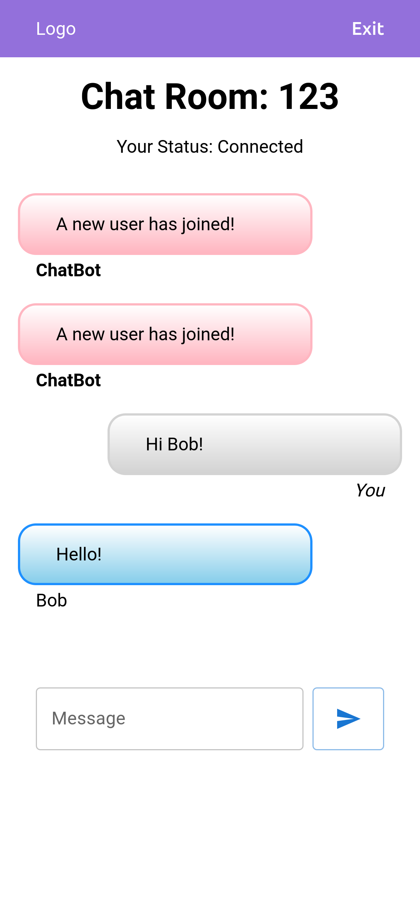
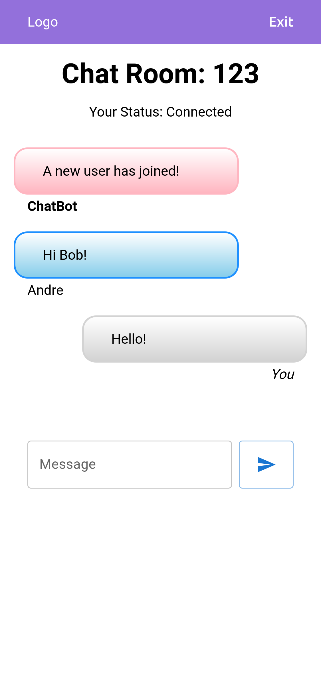
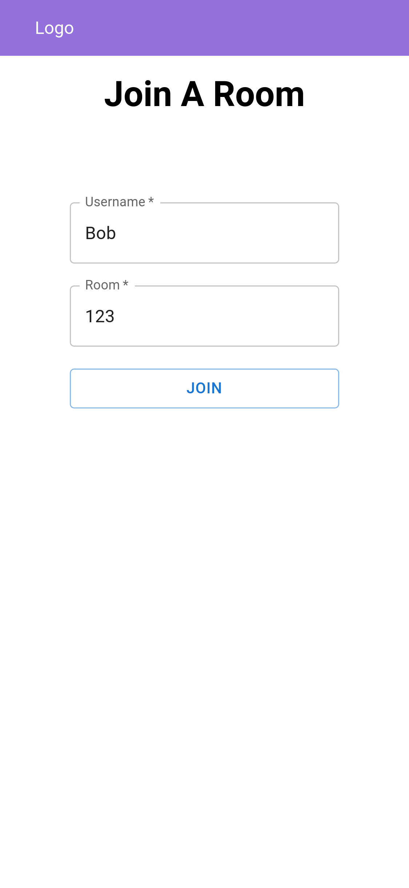

# React Chat Demo

A React chat app demo with Express.js Socket.io server.

Any user can log in with a name and room number. The room will display a general message using the socket broadcast feature to notify the rest of the room of users joining or leaving. Messages from users will be broadcast to all in the room.

The UI will identify your chat bubble as 'you', another user by their username and the server messages as 'ChatBot'.

## React App

- Written in TypeScript
- MaterialUI for basic styles
- React-router-dom for navigation
- Socket.io-client for socket communication with server

## Express.js Socket.io Server

- Express.js framework for quick setup
- Socket.io server library
- Cors middleware for accepting external connections

## A Sample Chat

| Person 1                                 | Person2                                  |
| ---------------------------------------- | ---------------------------------------- |
|  |  |

## Example Login

